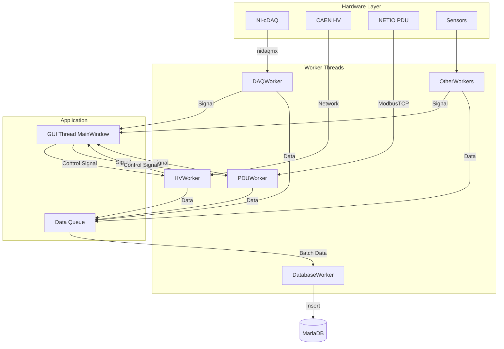

# RENE-PM (Project Integrated Monitoring System)

RENE-PM은 물리 실험 환경의 다양한 장비를 통합 모니터링하고 제어하기 위해 개발된 PyQt5 기반의 데스크톱 애플리케이션입니다. 환경 센서 데이터부터 고전압 장비, 전력 분배 시스템까지 다양한 하드웨어의 상태를 실시간으로 수집, 시각화하고 데이터베이스에 안정적으로 기록합니다.

## 1. 프로젝트 정보

*   **현재 버전:** 2.1.0
*   **개발 환경:** Python 3.8+, PyQt5
*   **데이터베이스:** MariaDB (또는 MySQL)
*   **주요 목표:** 실험 환경의 안정적인 모니터링, 데이터 로깅, 주요 장비(HV, PDU)의 원격 제어 및 자동화.

## 2. 주요 기능 (Key Features)

### 2.1. 실시간 모니터링 및 데이터 수집

*   **환경 센서:** 온도, 습도, 액체 레벨, 자기장(Bx, By, Bz), 라돈 농도, 산소 농도 등.
*   **지원 장비:** NI-cDAQ, Arduino, Serial 기반 센서 등.
*   **데이터 로깅:** 모든 센서 및 장비 데이터는 MariaDB에 타임스탬프와 함께 기록됩니다.

### 2.2. 장비 제어 및 관리

*   **고전압(HV) 시스템 (CAEN):**
    *   채널별 실시간 전압(VMon), 전류(IMon) 모니터링.
    *   원격 제어: 전압 설정(V0Set), 전류 제한(I0Set), 채널 Power ON/OFF.
*   **전원 분배 장치(PDU) (NETIO PowerPDU):**
    *   Modbus TCP 프로토콜 지원.
    *   포트별(8채널) 전력(W), 전류(mA), 누적 에너지(Wh) 모니터링.
    *   GUI를 통한 개별/전체 포트 원격 ON/OFF 제어.
*   **UPS 상태 감시 및 자동화:**
    *   UPS 배터리 상태 모니터링 및 정전 시 HV 시스템 자동 셧다운(Emergency Shutdown) 기능.

### 2.3. 데이터 시각화 및 분석

*   **실시간 대시보드:** 주요 지표 및 장비 상태를 한눈에 확인 가능.
*   **시계열 그래프:** PyQtGraph을 이용한 고성능 실시간 데이터 플로팅.
*   **데이터 분석 도구 (Analysis Tab):** 과거 데이터 조회, 시계열 분석, 상관관계 분석(Correlation Analysis) 및 CSV 데이터 내보내기 기능 제공.

## 3. 시스템 아키텍처 (System Architecture)

RENE-PM은 안정적인 데이터 수집과 반응형 UI를 보장하기 위해 **생산자-소비자(Producer-Consumer) 패턴**과 **Worker Thread 기반 비동기 아키텍처**를 사용합니다.



### 기술 스택 (Tech Stack)

  * **Language:** Python (3.8+)
  * **GUI Framework:** PyQt5
  * **Visualization:** PyQtGraph, Matplotlib
  * **Database:** MariaDB
  * **Hardware Communication:** `pymodbus` (v3.0+), `nidaqmx`, `pyvisa`, `pyserial`
  * **Data Processing:** `pandas`, `numpy`

## 4\. 설치 및 설정 (Installation & Configuration)

### 4.1. Prerequisites

1.  Python 3.8 이상 설치.
2.  MariaDB 서버 설치 및 데이터베이스/사용자 계정 생성.
3.  (Optional) NI-DAQmx 드라이버 (cDAQ 사용 시).

### 4.2. Installation

1.  리포지토리를 클론합니다:

    ```bash
    git clone https://github.com/opercjy/RENE_PM.git
    cd RENE_PM
    ```

2.  필요한 Python 패키지를 설치합니다:

    ```bash
    pip install PyQt5 pyqtgraph numpy pandas matplotlib mariadb pymodbus nidaqmx pyvisa pyvisa-py
    ```

### 4.3. Configuration (`config_v2.json`)

프로젝트 루트에 있는 `config_v2.json` 파일을 수정하여 데이터베이스 연결 정보와 각 하드웨어(IP 주소, 포트, 폴링 주기 등)의 설정을 정의합니다.

**주요 설정 섹션 예시:**

```json
{
    "database": {
        // ... DB 연결 정보 ...
    },
    "caen_hv": {
        // ... CAEN HV 설정 ...
    },
    "netio_pdu": {
        "enabled": true,
        "ip_address": "192.168.0.2",
        // ... PDU 설정 및 포트 맵핑 ...
    }
    // ... 기타 센서 설정 (daq, radon, ups 등) ...
}
```

## 5\. 실행 (Usage)

```bash
python rene_pm_main.py
```

## 6\. 주요 파일 구조 (Project Structure)

```
RENE_PM/
├── rene_pm_main.py       # 메인 애플리케이션 진입점 및 MainWindow (UI/제어 로직 포함)
├── ui_manager.py         # UI 레이아웃(인디케이터, 환경 그래프) 생성 관리
├── config_v2.json        # 시스템 설정 파일
├── workers/
│   ├── database_worker.py # 데이터베이스 처리 워커
│   ├── pdu_worker.py      # PDU 통신 및 제어 워커 (v2.1)
│   ├── hv_worker.py       # HV 통신 및 제어 워커
│   ├── hardware_manager.py # 하드웨어 탐지 및 관리
│   └── (기타 센서 워커들...)
├── PATCH_NOTES.md        # 버전별 변경 이력
└── README.md
```

## 7\. 변경 이력 (Changelog)

자세한 버전별 변경 이력은 [PATCH\_NOTES.md] 파일을 참조하세요.
